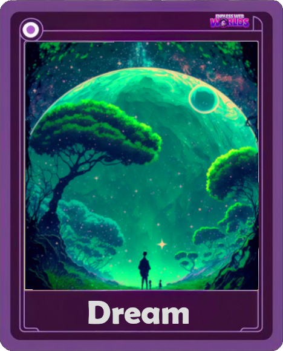
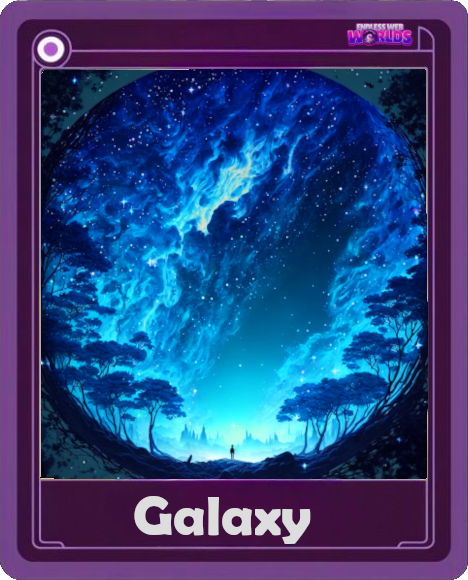
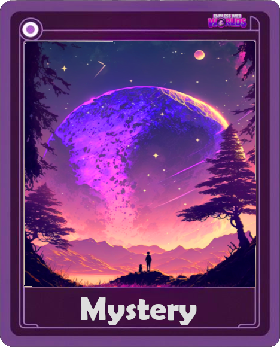
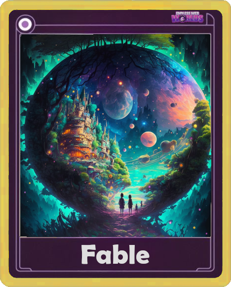

## NFT-Word

Every world is represented by a unique, minted non-fungible token (NFT). .

The NFTs that represent these ownable worlds are stored on the blockchain, making them tamper-proof and verifiable. This ensures that the ownership of each
world is clear and transparent, and that no one can claim ownership of a world that doesn't belong to them.

The NFTs can also be traded on various marketplaces, allowing for the buying and selling of worlds within the metaverse. This creates a new type of economy,
where virtual land is just as valuable as physical land.

### Realms

One of three possible realm worlds is available on the minting a world NFT. We hope to hold events, contests, and team-building exercises using this. Imagine
having a realm dedicated to gaming competitions, another to educational pursuits, and yet another to artistic activities.

### Special rarity

A rare world has a 1 in 10,000 chance of being created during the process of "world minting.". 
You get something special from minting this : TBD

First special image:

