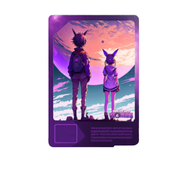

## Oracle

You can find the source

The decentral oracle, deployed on [Shibarium](https://shibatoken.com/), is responsible for storing important world data, such as the location of dynamic data on
the specific blockchain. The decentral oracle acts as a central source of truth, providing a reliable and secure way for nodes to access the dynamic world data
for all virtual worlds. It is a vital component in the functioning of our virtual world system as it ensures consistency and accuracy of the data across all
worlds.

When a world is created on the decentralized oracle, it is assigned to a specific owner as a NFT on Shibarium (direct minted). This owner has full ownership of the world, including the ability to
transfer and trade the world to other users.

### Contract snippet

```jsx title="Fixed world data and version"
struct World {
  uint256 id;
  string name;
  string mainNode;
  uint256 chainId;
  address chainContract;
  address owner;
}
```

### A rare NFT world

A rare world has a 1 in 20,000 chance of being created during the process of "world minting." These worlds differ from the underlying base IPFS source and can have different metadata like Image, rarity_level : 1-1000 and can be dynamically added.

Base image:



Rare imgage TBD
