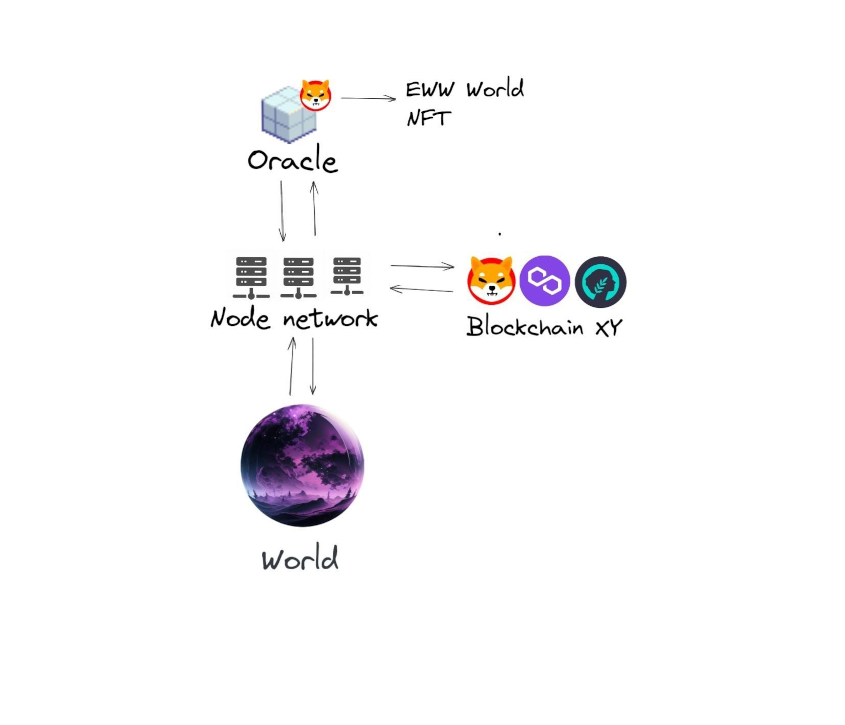

## About

Endless Web Worlds is a sandbox experience unlike any other. Everything may be customized immediately in your browser using the most common programming language, JavaScript. Even if you aren't a developer, you may benefit from the simple snippets that we and the community will provide.

Endless Web Worlds allows you to design your own virtual world and personalize it to your liking. The possibilities are unlimited, whether you're constructing a full metropolis, a gaming environment, or a virtual reality!

We will also provide a wealth of courses, documentation, and assistance to assist you in getting started.

---

## Contribute

We believe in the power of community and cooperation at EWW. We work hard to provide a platform that is not only useful, but also continually developing and expanding. This is when you come into play. You may help us push the frontiers of what is possible and create the future of virtual worlds by contributing to EWW.

There are several ways to help, including providing suggestions and feedback reporting bugs and issues, and building and implementing new features. You may also join our community and help us maintain our open-source codebase.

Your contributions will not only help to make EWW better, but also help to shape the future EWW. So don't hesitate, join us and help to build a better future
for EWW and the virtual world community.

## Techstack

EWW is cross-platform agnostic
and runs directly within the browser, ensuring accessibility and ease of use for all. Users can expect a smooth and efficient experience, while developers have
the flexibility to work with their beloved javascript technologies.
Also our backend ist written in NodeJs with basis on JS and will be fully open source!

  

## Dataflow

The flow can best be explained using the different perspectives

### Player perspective

As a player, I enter a virtual world and request information from the node. The node retrieves the necessary data, such as the world's chainId, contract, and
name, from the central data oracle if it's not already stored. It then fetches the latest information about the world, including asset positions and other
relevant details, from the Blockchain XYZ using the chainId and contract. Once the data is collected, it's stored on the node's server and displayed to me, the
player.

### Builder perspective

As a builder, I place assets within a virtual world, and the node receives and stores this information on its server. This data is only accessible on that
specific node, acting like a private server until I choose to publish my changes via the client -> The node uses then the configured chainId and contract address to store the data on
the specified blockchain, the world data is now public and will be fetched by every node that is running on that specific world at the moment. This ensures that the information is persistent and can be accessed by any node that needs it.

## Assets

Assets are the building blocks of a virtual world, they can be in the form of floor tiles or objects that are placed within the world. These assets play a vital role in creating a believable and immersive environment. When an asset is placed within a world, it will be uploaded to IPFS (InterPlanetary File System). This allows for the assets to be easily shared, stored, and accessed by others within the world. IPFS is a peer-to-peer network that enables the storage and sharing of files in a decentralized manner, making it a perfect fit for the distribution and management of assets in a virtual world. By using IPFS, assets can be easily accessed, shared and updated by other users and developers, making it simple to collaborate and build together in virtual spaces.

Artists will be able to wrap their assets into NFT packs or just indivudal NFT and sell it easily at the [EWW Marketplace](/docs/About/Features#marketplace)

The marketplace offers people can view and sell their own created assets or artwork. This way, everyone can make money by monetizing the content they create and share.
Artists will be able to wrap their assets into packs or just indivudal and sell it easily at the [EWW Marketplace](