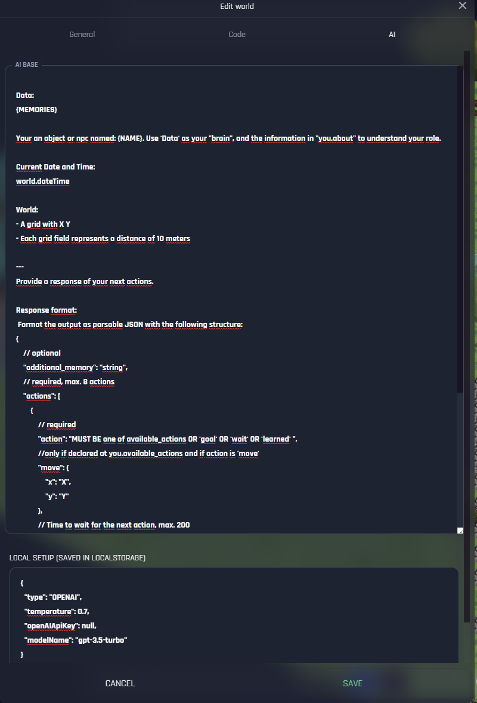

# Advanced
For the advanced users we are offering the possibility to adjust the LLM base template, provide their own API key and choose their own LLM model like Cohere or else.


## Ai base 
The AI base is basically the prompt which will be sent on each request and can be adjusted.
You find it at the World editor



### {Memories}

The memories is a Json object that is getting updates on different kind of things like speaking or else:

```jsx
{
  "world": {
    "size": {
      "x": 40,
      "y": 40
    },
    "about": "A Dormitory of the endless unversity ",
    "dateTime": "Sat, 09 May 2026 05:58:00 GMT"
  },
  "you": {
    "name": "Mia",
    "about": "i love to have a good conversation about ai technology",
    "position": {
      "x": 3,
      "y": 30
    },
    "available_actions": [ // based on the setup 
      "say",
      "move",
      "attack"
    ]
  },
  "objects": [
    {
      "name": "Mia",
      "position": {
        "x": 23,
        "y": 14
      }
    },
    {
      "name": "Test",
      "position": {
        "x": 22,
        "y": 14
      }
    },
    {
      "name": "Studen kitchen near fridge ",
      "position": {
        "x": 7,
        "y": 11
      }
    },
    
  ],
  "activities": [
    {
      "action": "conversation",  // based on the setup move, goal, learned
      "object_name": "Test",
      "text": "Hi",
      "dateTime": "Sat, 09 May 2026 05:55:00 GMT"
    }
  ],
  "activeConversations": [
    {
      "name": "test",
      "text": "jo mia",
      "dateTime": "Sat, 09 May 2026 05:58:00 GMT"
    }
  ],
  "pastConversations": [],
  "goal": null,
  "learned": []
}
```

You can call the memories with 

```jsx
getAiEnvironment()
```

Or the current state of the asset with 
```jsx
getAiCurrentState()
```


## Local playaround

correct this: with the local playground players can use their own APi key and change it to any supported Langchain model.

All the config and will only be "saved" in the locale storage 

https://js.langchain.com/docs/modules/models/llms/integrations

```jsx
{
    type: "OPENAI", // "OPENAI" | "HUGGINGFACE" | "REPLICATE",
    temperature: 0.7,
    openAIApiKey: null, //OPENAI_API_KEY
    modelName: 'gpt-3.5-turbo',
}

```

## Changing model
We looking to extend it in the further. If you really want to play around with other models you could do it easily by writing javascript at any asset


## Whole code
On the following you can see the whole code of an asset with an ai model to copy it maybe in the code editor and fully adjust it. (Disclaimer : not clean atm)

```jsx
    let aiObject = null;
    let aiMemory = [];
    let activeConversations = [];
    let pastConversations = [];
    let goal = null;
    let learned = [];
    let currentRun = null;
    let isLoadingAct = null

    function addMemory(action, type) {
        aiMemory.push(action);
        if (aiMemory.length > 30) {
            aiMemory.shift();
        }
    }

    function getAiEnvironment() {
        return getAiEnvironment();
    }

    function getAiCurrentState() {
        const cloneAi = JSON.parse(JSON.stringify(aiObject));
        cloneAi.activities = aiMemory;
        cloneAi.activeConversations = activeConversations;
        cloneAi.pastConversations = pastConversations;
        cloneAi.goal = goal;
        cloneAi.learned = learned;
        return cloneAi;
    }

    async function aiInit(_data) {
        try {
            const { data } = _data;
            aiObject = data.aiObject;

            function updateMemory() {
                aiObject.world.dateTime = getWorldDate();
                aiObject.objects = getAllObjects($this.id);
                aiObject.you.position = $this.getPosition();
            }

            anyoneTalked((textData) => {
                const isMe = textData.name.toLowerCase().includes($this.data?.name?.toLowerCase() ?? "");
                if (isMe) {
                    return;
                }

                if (textData.text.includes("*")) {
                    return;
                }

                updateMemory();
                const text = textData.text ?? "";

                const my_name = $this.data?.name?.toLowerCase() ?? "";
                const meansme = text.toLowerCase().includes(my_name) || textData?.targetName?.toLowerCase().includes(my_name);

                if (meansme) {

                    if (isAnyPlayerInRadius(data.aiTriggerMentionedRange ?? 14) == null) {
                        return;
                    }

                    activeConversations.push({
                        name: textData.name,
                        text: textData.text,
                        dateTime: getWorldDate(),
                    });

                    actNPC(getAiCurrentState(), true)
                } else {
                    addMemory({
                        action: "conversation",
                        object_name: textData.name,
                        object_target_name: textData.targetName,
                        text: textData.text,
                        dateTime: getWorldDate(),
                    })
                }
            })

            if (data.aiTriggerSeconds) {
                addInterval(setInterval(() => {
                    if (isAnyPlayerInRadius(data.aiTriggerSecondsRange ?? 14) == null) return;

                    updateMemory();
                    actNPC(getAiCurrentState())
                }, data.aiTriggerSeconds * 1000));
            }
        }
        catch (e) {
            console.log(e)
        }
    }

    async function actNPC(promptObj, force = false) {

        switchMap(async () => {
            try {

                if (!imGameMaster()) {
                    return;
                }

                if ($this.obj.isLoadingAct && force == false) {
                    return;
                }

                $this.obj.isLoadingAct = true;

                const NPC_NAME = $this.data?.name ?? "NPC"
                const temp = game.worldData?.aiBase ?? baseNPCTemplate;
                const prompter = temp.replace("{NAME}", NPC_NAME).replace("{MEMORIES}", JSON.stringify(promptObj));

                const res = await aiClient.actNPC(prompter, $this.id);

                const run = createGUID();
                currentRun = `${run}`;


                const parsed = JSON.parse(res);
                const arr = parsed.actions;
                const newMemory = parsed.additional_memory;

                if (newMemory && newMemory != "") {
                    aiMemory.concat(newMemory);
                }
                for (let i = 0; i < arr.length; i++) {
                    try {
                        if (currentRun != run) {
                            break;
                        }

                        const json = arr[i];

                        const actiondata = {
                            object_name: NPC_NAME,
                            dateTime: getWorldDate(),
                        };

                        if (json.action == "move") {
                            moveTo(json.move.x, json.move.y);
                            actiondata.object_action = "move";
                        }

                        if (json.action == "attack") {
                            ai_attack(xyToMapPos(json.attacking.x, json.attacking.y));
                            actiondata.object_action = "attack";
                        }

                        if (json.action == "say" && json.say?.message) {
                            displaySpeechBubble(json.say.message, NPC_NAME, json.say.receiver_name);
                            activeConversations.push({
                                name: NPC_NAME,
                                text: json.say.message,
                                dateTime: getWorldDate(),
                            });

                            // delete old conversations where time is more than 3 hours ago
                            const now = new Date(getGameDate());
                            const thirtyMinutesAgo = new Date(now.getTime() - 240 * 60000);
                            pastConversations.push(...activeConversations.filter((o) => {
                                const date = new Date(o.dateTime);
                                return date < thirtyMinutesAgo;
                            }));
                            activeConversations = activeConversations.filter((o) => {
                                const date = new Date(o.dateTime);
                                return date > thirtyMinutesAgo;
                            });

                        }

                        if (json.action == "learned" && json.learned) {
                            learned.push(json.learned);
                            displaySpeechBubble("(learned) *" + json.think + "*", NPC_NAME);

                            if (learned.length > 6) {
                                learned.shift();
                            }
                        }

                        if (json.action == "goal") {
                            displaySpeechBubble("(goal) *" + json.goal + "*", NPC_NAME);
                            goal = json.goal
                        }


                        if (json.wait) {
                            await sleep(json.wait * 1000);
                        }

                        if (json.action == "wait" && json.wait) {
                            await sleep(json.wait * 1000);
                        }

                        await sleep(500);

                    } catch (e) {
                    }
                }

                isLoadingAct = false;
            } catch (e) {
                isLoadingAct = false;
                throw new Error(e);
            }
        }, 1000)()
    }

```